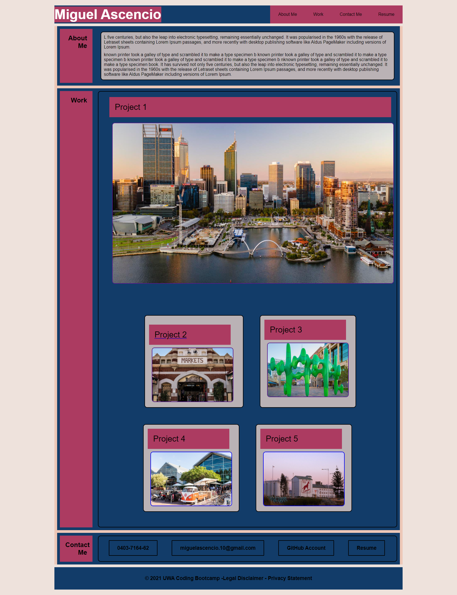

# Portfolio

Here you will find my very first attempt to create a professional portfolio, it will improve over time... but at this stage you can find:

* Navigation bar linked to the corresponding item.
* All images are linked to a new page where future projects are going to be.
* A responsive behaviour targeting I-pads of 768px width and mobile devices of 350px width.

Buttons and footer are just to show at the moment.

## Preview of portfolio 

### Link to deployed page

[https://miguel-thethird.github.io/Homework-02/]